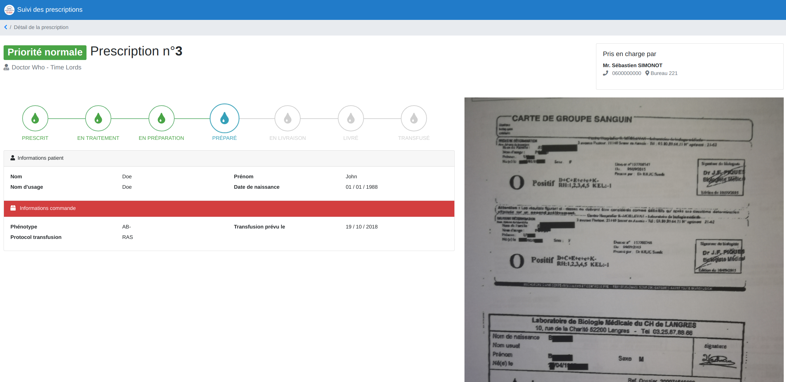
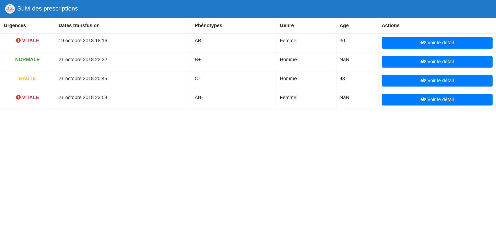

# Bloodcoin

Preuve de concept de l'utilisation d'une chaîne de blocs pour le suivi/validation du processus transfusionnel.

Projet réalisé en 48h durant le [Hacking Health Besançon 2018](https://hacking-health.org/fr/besancon-fr/).

## Captures d'écran

Le prototype d'application web implémenté se nourrit directement des données de la chaîne de blocs, via une API REST.





## Démarrer avec les sources

```shell
# Récupération de l'application web
git submodule init
git submodule update --remote
cd web
npm install

# Compilation du CLI et de l'application web
cd -
go build -o ./bloodcoin-cli ./cmd/cli
go build -o ./bloodcoin-server ./cmd/server
```

## FAQ

### Initialiser une nouvelle chaine de blocs / lister les blocs présents

```shell
./bloodcoin-cli dump
```

### Ajouter une nouvelle prescription (demande de poche de sang) dans la chaine de blocs

```shell
# Voir le fichier sample/valid_prescription.json pour connaitre les données intégrables
# dans une prescription
./bloodcoin-cli prescription -data "$(cat sample/valid_prescription.json)"
```

### Ajouter une notification d'avancement du processus de livraison de la poche

```shell
./bloodcoin-cli notification -prescription <hash_prescription> -type <type> -firstName <prénom intervenant> -lastName <nom intervenant> -service <service_intervenant>
```
**Notification possibles**
 - `received`
 - `packaging`
 - `packaged`
 - `delivering`
 - `delivered`
 - `transfused`


## License

[AGPL-3.0](https://www.gnu.org/licenses/agpl-3.0.html)